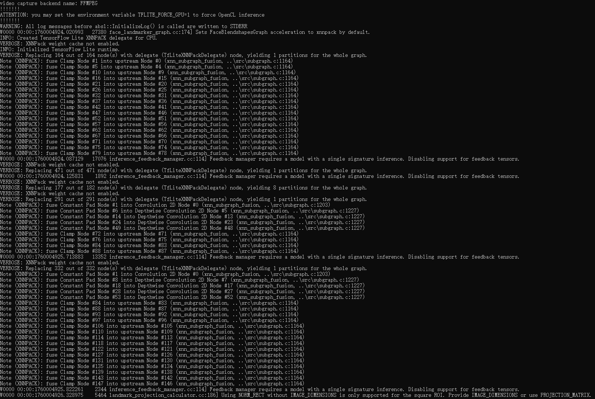
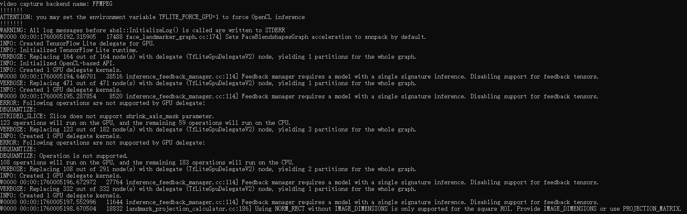

## Build MediaPipe C API Shared Library with GPU inference support  

  

  

  

You may set the environment variable **TFLITE_FORCE_GPU=1** to force GPU inference.  

Disclaimer: This video is purely for technical demonstration, using public video for input.  

  

  

  

  
